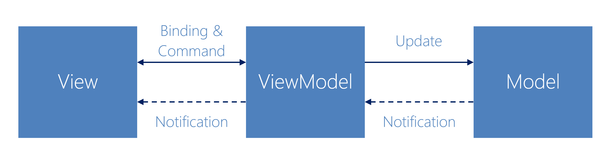
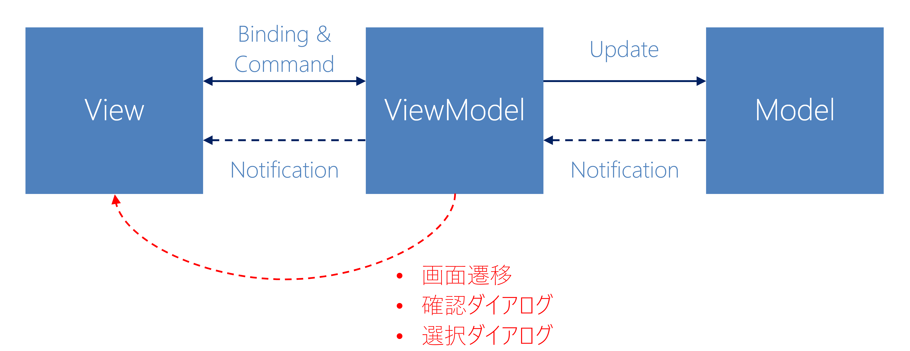

## Prism for Xamarin.Forms
## 入門 Hans-On

+++

## はじめに

+++

### Hands-onの目的

次を理解していただくのが本Hands-onの目的となります。

1. なぜPrismを使うのか？  
    1. 誰がPrismを使うべきか？  
    2. Prismを使うべきではない場合は？  
2. Prismの基本的な機能の利用方法

Note:

本ハンズオンは大きく二つの目的をもって開催しています。

ひとつはXamarin.FormsでPrismを利用する動機を正しく理解していただくことです。
利用に適したケースがどういったケースで、逆に適さないケースがどういったケースなのか理解いただきます。

その上で、実際にPrismを利用してアプリケーションを開発する上で基本的な利用方法を、ハンズオン形式で理解していただきます。

+++

## なぜPrismを使うのか？

Note:

それではまず、なぜPrismを利用すべきなのか？  
その動機について説明いたします。  

+++

### Prismとは何か？

* XAML Application Framework  
* Guidance  
* Patterns & Practices  
* Testable & Maintainable  
* Open Source  
* .NET Foundation  

Note:

Prismの製作者であるBrian Lagnus氏は次のようにおっしゃっています。  
プリズムはXAMLアプリケーションフレームワークです。  
そして、プリズムはガイダンスであり、パターンやプラクティスの集合でもあります。  
プリズムを使うと、アプリケーションは自然とテストしやすく、変更も容易になります。  

+++

### Prismは何を提供するか？

* MVVM Support
* Commanding
* Messaging
* Navigation
* Page Dialog Service
* Dependency Injection
* Logging

Note:

プリズムは利用者にMVVMのSupportを提供します。  
* Commanding  
* Messaging  
* Navigation
* Page Dialog Service  
* Dependency Injection  
そしてLoggingです

+++

### Xamarin.Formsの最初の悩み  

Xamarin.Formsをつかう  
-> MVVMパターンにしよう  
-> 素のままだとつらい！

Note:

Xamarin.Formsで開発しようとした場合、特別な理由がない限りはMVVMパターンを利用することになると思います。
しかしXamarin.Forms単独ではMVVMパターンを利用する上で、なかなか辛い点もあります。

+++

### MVVMパターン概要 　

Note:

その前に、MVVMパターンの概要を一度確認しておきたいと思います。  
MVVMパターンではアプリケーションをView・ViewModel・Modelの３つに分類して設計・実装します。

この時、Viewは「どう表示するか？」を定義にし、「具体的な値は何を表示するか？」はViewModelのプロパティとして定義し、それをViewにバインドすることで表示します。  
Viewで何らかのユーザー操作が行われたら、ViewModelのバインドされているプロパティを更新するか、ViewModelのコマンドを実行します。  

ViewModelで何らかのロジックを実行した結果、ViewModelの値が更新された場合、更新されたことをViewへ通知し、Viewは表示内容を更新します。  

これが基本の流れとなります。

+++

### MVVMパターンの悩みどころ

Note:

この際、素のXamarin.Formsだけでは辛いのは、ViewModelからViewを操作したいといったケースです。  
具体的には、画面遷移やアラート・確認ダイアログといった操作になります。  
こういった悩みどころを解決してくれるのがPrismです。  

+++

### なぜPrismを使うか？  

* 「MVVMパターンの悩みどころ」の解決
    * 画面スタックの復元まで考慮された画面遷移サービスの提供 　
    * アラート・確認ダイアログ・アクションシート サービスの提供
* 各種ベストプラクティスの提供 　
    * アプリケーション設計ガイダンスの提供 　
    * 各種パターン・プラクティスの提供 　
    * 結果 -> テスト・メンテナンス容易性の実現

Note:

あらためて、なぜPrismを使うのか、整理して見ましょう。  

Prismは先ほどのお話しした、MVVMパターンのよくある悩みどころを解決してくれます。  

そして、それ以上に価値があるのが、Prismは各種ベストプラクティスを提供してくれるという点にあります。  
ガイダンスや各種パターン・プラクティスが自然に取り込まれ、その結果、テストやメンテナンスの容易性が確保しやすくなる。  
これこそがPrismの真価です。  

+++

### Prismを使うと良いケースは？

* MVVMパターンの理解へ不安がある人
* Prismの（特に画面遷移周り）がマッチするアプリケーションの作成者

Note:

つまりPrismを適用すべきケースというのは、第一にMVVMの理解に不安がある人が該当します。  
Prismを利用することで、MVVMパターンを適用する上での多くの課題が、自然に解決する事が出来ます。  

もちろん、MVVMへ習熟している人でも、Primsの特に画面遷移周りの要件がマッチするのであれば、利用する価値は大いにあります。

+++

### Prismを使うべきではないケースは？

* 複雑で特殊な画面遷移が多く、Prismのマッチしないアプリケーションの作成者  
* MVVMパターンの理解が深く、独自のアーキテクチャを採用したい人

Note:

逆に複雑で特殊な画面遷移が多く、Prismの画面遷移周りがマッチしないのであれば、Prismを採用する価値は大きく下がります。  

また、Prismはフルスタックに近いフレームワークですから、ある程度「押しつけ」の強い側面があります。  
MVVMパターンに深い理解があり、既存資産や確たるアーキテクチャへのこだわりがあるのであれば、Prismを採用する理由も少ないかもしれません。  

+++

## Hands-on Program

Note:

それでは実際にハンズオンに入る前に、ハンズオンの概要について簡単に説明します。

+++

### Hands-on Menu

1. 事前準備
2. Prismをアプリケーションに適用する
3. ViewModelLocatorを利用してViewModelを適用する
4. BindableBaseを利用する
5. EventToCommandBehaviorを使う
6. 基本の画面遷移
7. Platform Initializer

Note:

ハンズオンのプログラムの概要はこちらのとおりです。  
画面遷移については、基本パターンについて学習していただきます。  
複雑なパターンは時間的に困難なため、自習素材として用意していますので、早く進んだ方はぜひトライして見てください。  

+++

### Hands-onの流れ

各セクションごとに次の流れで進めます。  

1. 各セクションの目的の共有  
2. テキストに則って作業の実施  
3. 各セクションの振り返り 

Note:

ハンズオンの個々のセクションでは、まずそのセクションの目的を理解いただき、つづいてテキストに従ってハンズオンを実施していただきます。  
分からない箇所があれば、適宜挙手ください。  
また早く終わった方は、同一テーブル内で協力しあって進めていただけると助かります。  
全員が終わったところで、軽く振り返って、次のセクションへ進むという流れで行います。  

+++

## Let’s start Hands-on

[https://github.com/jxug/PrismHandsOn](https://github.com/jxug/PrismHandsOn)
