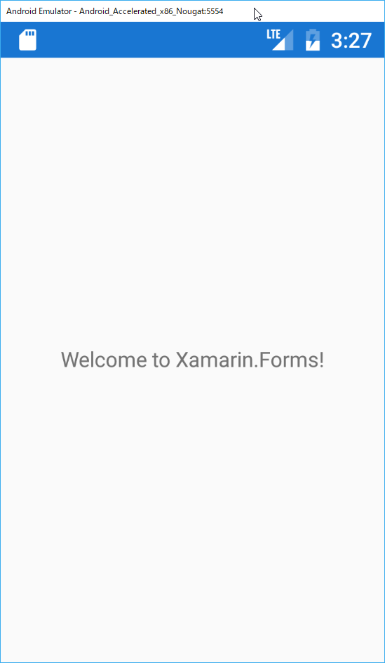

# Prismをアプリケーションに適用する

## 目的  

* 素のXamarin.FormsにPrismを適用することで、Prismの基本を理解する

## 手順

1. Appの親クラスをPrismApplicationに変更する  
2. DIコンテナにMainPageを登録する  
3. Mainページへ画面遷移する  

なお今回は、DIコンテナにAutofacを利用する想定で進めます。  

## Appの親クラスをPrismApplicationに変更する  

App.xaml
```cs
<?xml version="1.0" encoding="utf-8" ?>
<autofac:PrismApplication xmlns="http://xamarin.com/schemas/2014/forms"
             xmlns:x="http://schemas.microsoft.com/winfx/2009/xaml"
             xmlns:autofac="clr-namespace:Prism.Autofac;assembly=Prism.Autofac.Forms"
             x:Class="PrismHandsOn.App">
</autofac:PrismApplication>
```

ルート要素をautofac:PrismApplicationに変更し、名前空間として「xmlns:autofac～」を追記してください。

App.xaml.cs
```cs
using System;
using Prism.Ioc;
using PrismHandsOn.Views;
using Xamarin.Forms;

namespace PrismHandsOn
{
    public partial class App // : Application 宣言を削除する。
    {
        protected override void RegisterTypes(IContainerRegistry containerRegistry)
        {
        }

        protected override void OnInitialized()
        {
        }
    }
}
```

XAML側で親クラスを指定している（XAMLのルート要素が親クラスを表し、今回はPrismApplicationが該当する）ため、xaml.cs側では親クラスの指定は不要な為削除します。

また元々実装されていたメソッド群を削除し、OnInitializedとRegisterTypesの二つのメソッドを定義してください。


## DIコンテナにMainPageを登録する  

初期画面を遷移するため、DIコンテナへMainPageのクラスをNavigation対象のクラスとして追加します。

App.xaml.cs
```cs
protected override void RegisterTypes()
{
    containerRegistry.RegisterForNavigation<MainPage>();
}
```

## Mainページへ画面遷移する  

つづいて、初期画面への画面遷移処理を実装します。

App.xaml.cs
```cs
protected override void OnInitialized()
{
    NavigationService.NavigateAsync(nameof(MainPage));
}
```

ここまで一旦デバッグ実行し、動作を確認します。
先ほどと同じ画面が表示されれば、Prismのアプリケーションへの適用完了です。



## 補足説明

Prismでは画面遷移にはINavigationServiceを利用し、画面遷移名を指定して遷移させます。
今回はRegisterForNavigationにMainPageを登録しています。デフォルトでは画面名＝遷移名となるため、上記のコードでは遷移名としてnameof(MainPage)を指定しています。

画面クラスの名称と遷移名のマッピングは変更可能な為、画面名と遷移名は明確に区別してとらえる必要があります。


# Next

[ViewModelLocatorを利用してViewModelを適用する](03-ViewModelLocatorを利用してViewModelを適用する.md)
