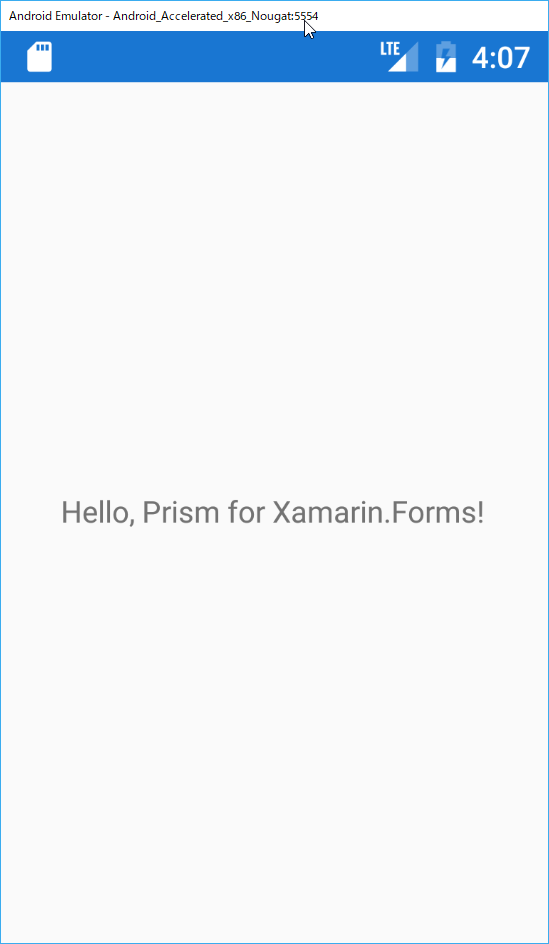

# ViewModelLocatorを利用してViewModelを適用する

ここまでMainPageはViewModelを持たない、単独のオブジェクトでした（実際にはViewの子要素を持ちますが）。

Xamarin.Formsでは強力なバインディング機構を提供しているため、プレゼンテーション層のデザインパターンはMVVMパターンと非常に相性が高く、MVVMを意識した設計が元から取り入れられています。

という事で、まずはMainPageにViewModelを追加し、ViewModelのプロパティをViewにバインドして表示していきたいと思います。

なお今後、ViewやViewModelを複数登録していきます。またPrismの機能を最大限活用するため、フォルダを整理しつつMainPageにViewModelを適用していきます。

具体的な手順は次の通りです。

1. MainPageViewModelの作成  
2. ViewModelのプロパティをViewへバインド

## MainPageViewModelの追加  

ViewModelsフォルダにMainPageViewModel.csを追加し、次のように実装します。

```cs
using Prism.Mvvm;

namespace PrismHandsOn.ViewModels
{
    public class MainPageViewModel : BindableBase
    {
        public string Message { get; } = "Hello, Prism for Xamarin.Forms!";
    }
}
```

BindableBaseを継承して実装し、Messageプロパティを宣言しています。BindableBaseはINotifyPropertyChangedインターフェースを実装した、ViewModelなどの基底クラスとして利用できるクラスです。プロパティの変更通知を行う場合に利用しましょう。

## ViewModelのプロパティをViewへバインド  

追加したViewModelのMessageプロパティを、MainPageのラベルにバインドします。

変更前のコードではラベルのTextプロパティにはリテラル値が設定されていました。

変更前
```xml
	<Label Text="Welcome to Xamarin.Forms!" 
           VerticalOptions="Center" 
           HorizontalOptions="Center" />
```

これをMessageプロパティをバインドするように変更します。

変更後  
```xml
	<Label Text="{Binding Message}" 
           VerticalOptions="Center" 
           HorizontalOptions="Center" />
```

それでは実行してみましょう。



表示される文字列が

> Welcome to Xamarin.Forms!

から

> Hello, Prism for Xamarin.Forms!

に変更されていれば成功です。

通常、例えばXAML上でViewに対してViewModelを設定しようとした場合、次のようなコードが必要です。

```xml
<?xml version="1.0" encoding="utf-8" ?>
<ContentPage xmlns="http://xamarin.com/schemas/2014/forms"
             xmlns:x="http://schemas.microsoft.com/winfx/2009/xaml"
             xmlns:viewModels="clr-namespace:PrismHandsOn.ViewModels;assembly=PrismHandsOn"
             x:Class="PrismHandsOn.Views.MainPage">
    <ContentPage.BindingContext>
        <viewModels:MainPageViewModel/>
    </ContentPage.BindingContext>
```

Prismでは基本ケースではViewとViewModelは命名規則により自動的に特定してバインドしてくれます。この役割を果たしてくれているのがViewModelLocator（＋α）になります。

これは一見ちょっとした便利機能に見えますが、実はPrismのアーキテクチャの根幹を支える重要な機能です。なぜ重要なのか、もう少し詳しい話は追々説明していきますが、一言でいうとDependency Injectionの起点になっているからです。

# Next

[EventToCommandBehaviorを使う](03.EventToCommandBehaviorを使う.md)