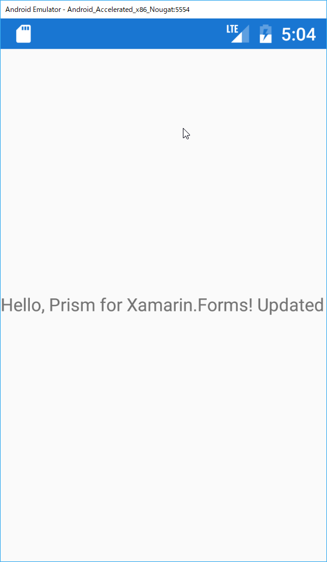

# EventToCommandBehaviorを使う

MVVMパターンを実装しているとよく遭遇する「あるある」に

「特定のイベントが発行されたらViewModelのCommandを実行したいのにCommandがバインドできない！」

というものがあります。

XAMLアーキテクチャを採用したアプリケーションでは、そういった場合は通常EventTriggerなどを使って実現するのですが、Xamarin.FormsではTriggerに設定できるActionがバインドに対応していないため、話が少しややこしくなります。

そこでPrismではEventToCommandBehaviorを提供しており、それを利用することで、あらゆるイベントから簡単にCommandを実行できる手段を提供しています。

ここでは、MainPage起動時のAppearingイベント発生時に、画面の表示メッセージを更新するよう実装していきます。

具体的な手順は次の通りです。

1. MainPageViewModel.csにAppearingイベントに対応するCommandを定義する  
2. MainPage.xamlにEventToCommandBehaviorを定義する

## MainPageViewModel.csにAppearingイベントに対応するCommandを定義する  

MainPageViewModel.csにCommandを定義し、Command実行時にMessageを更新するよう実装を修正します。

変更前
```cs
    public class MainPageViewModel : BindableBase
    {
        public string Message { get; } = "Hello, Prism for Xamarin.Forms!";
    }
```

変更後
```cs
using Prism.Mvvm;
using System.Windows.Input;
using Xamarin.Forms;

namespace PrismHandsOn.ViewModels
{
    public class MainPageViewModel : BindableBase
    {
        private string _message = "Hello, Prism for Xamarin.Forms!";

        public string Message
        {
            get => _message;
            set => SetProperty(ref _message, value);
        }

        public ICommand UpdateMessageCommand => new Command(() => Message += "Updated");
    }
}
```

大きく二点の変更が加えられています。

1. Messageプロパティが変更時にINotifyPropertyChangedの定義に従って、プロパティ変更を通知するように変更  
2. UpdateMessageCommandコマンドを追加し、実行時にMessageに「 Updated」を追加するように修正

INotifyPropertyChangedの変更通知はSetPropertyメソッドによって実装されており、その実態はPrismの提供するBindableBaseクラスにあります。

## MainPage.xamlにEventToCommandBehaviorを定義する

つづいてPageのAppearingイベント発生時に、UpdateMessageCommandを実行するよう、MainPage.xamlを更新します。

変更前
```xml
<?xml version="1.0" encoding="utf-8" ?>
<ContentPage xmlns="http://xamarin.com/schemas/2014/forms"
             xmlns:x="http://schemas.microsoft.com/winfx/2009/xaml"
             xmlns:local="clr-namespace:PrismHandsOn"
             x:Class="PrismHandsOn.Views.MainPage"
             Title="Main Page">
             ...
```

変更後
```xml
<?xml version="1.0" encoding="utf-8" ?>
<ContentPage xmlns="http://xamarin.com/schemas/2014/forms"
             xmlns:x="http://schemas.microsoft.com/winfx/2009/xaml"
             xmlns:local="clr-namespace:PrismHandsOn"
             xmlns:behaviors="clr-namespace:Prism.Behaviors;assembly=Prism.Forms"
             x:Class="PrismHandsOn.Views.MainPage"
             Title="Main Page">
    <ContentPage.Behaviors>
        <behaviors:EventToCommandBehavior EventName="Appearing" Command="{Binding UpdateMessageCommand}"/>
    </ContentPage.Behaviors>
    ...
```

ContentPageにEventToCommandBehaviorが追記され、EventNameにAppearingが、CommandにUpdateMessageCommandが設定されているのが見て取れるでしょう。

ContentPageの属性に「xmlns:behaviors=～」の宣言を追加するのを忘れないように注意しましょう。

それでは実行してみましょう。表示メッセージの末尾に「 Updated」が追加されていれば成功です。



# Next

[NavigationPageの適用](04-01.NavigationPageの適用.md)  