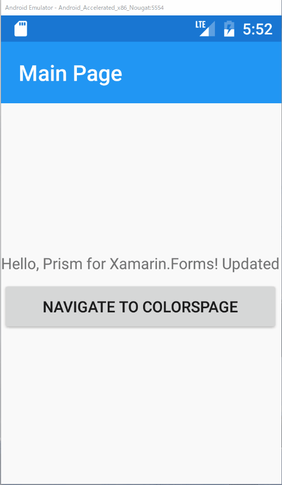

# 基本の階層ナビゲーション

Xamarin.Formsには2種類の画面遷移があります。

1. Hierarchical Navigation（階層ナビゲーション）  
2. Modal Navigation（モーダル ナビゲーション）  

ここでは1.の画面遷移の基本的な利用方法を説明します。

次の手順で実装していきます。

1. 新しいPageの追加  
2. DIコンテナへ新しいPageの登録  
3. MainPageViewModel.csに画面遷移処理の追加  
4. MainPage.xamlに画面遷移処理の呼び出しボタンの追加

## 新しいPageの追加

Viewsフォルダの下に、ContentPageを継承した「ColorsPage.xaml」という新しいページを追加してください。

標準のXamarinテンプレートで作成すると、つぎのようなコードが作成されるます（VS for Windows）。

Titleだけ追加でColorsに変更しています。

```cs
<?xml version="1.0" encoding="utf-8" ?>
<ContentPage xmlns="http://xamarin.com/schemas/2014/forms"
             xmlns:x="http://schemas.microsoft.com/winfx/2009/xaml"
             x:Class="PrismHandsOn.Views.ColorsPage"
             Title="Colors">
    <ContentPage.Content>
        <StackLayout>
            <Label Text="Welcome to Xamarin.Forms!"
                VerticalOptions="CenterAndExpand" 
                HorizontalOptions="CenterAndExpand" />
        </StackLayout>
    </ContentPage.Content>
</ContentPage>
```

## DIコンテナへ新しいPageの登録  

もう慣れてきたかもしれませんが、App.xaml.csを開き新しく追加したColorsPageをDIコンテナへ登録してください。

```cs
        protected override void RegisterTypes(IContainerRegistry containerRegistry)
        {
            containerRegistry.RegisterForNavigation<NavigationPage>();
            containerRegistry.RegisterForNavigation<MainPage>();
            containerRegistry.RegisterForNavigation<ColorsPage>();
        }
```

## MainPageViewModel.csに画面遷移処理の追加  

Prism for Xamarin.Formsでは、画面遷移処理はINavigationServiceを利用して行います。

PrismではINavigationService以外にも、多くのサービスが提供されていますが、基本的にDependency Injectionパターンに則ってサービスは提供されます。このため、サービスのインスタンスはnewするのではなく、外部からコンストラクタで設定してもらう必要があります。

具体的には次のように記述します。

```cs
    public class MainPageViewModel : BindableBase
    {
        private readonly INavigationService _navigationService;

        ...

        public MainPageViewModel(INavigationService navigationService)
        {
            _navigationService = navigationService;
        }
    }

```

コンストラクタの引数で受け取り、それをフィールドに保持しているのが見て取れます。

つづいて、画面処理を実行するCommandを実装しましょう。

```cs
        public Command<string> NavigateCommand => 
            new Command<string>(
                name => _navigationService.NavigateAsync(name));
```

App.xaml.csで記述したように、遷移名を指定して画面遷移を行います。この時、遷移名をViewModelに記述してもよいのですが、今回は画面側からCommandのパラメーターとして遷移先を受け渡してもらうよう実装しています。

# MainPage.xamlに画面遷移処理の呼び出しボタンの追加

それでは画面遷移処理の呼び出し箇所を実装します。

MainPage.xamlを開いてください。

変更前
```xml
<?xml version="1.0" encoding="utf-8" ?>
<ContentPage ...

	<Label Text="{Binding Message}" 
           VerticalOptions="Center" 
           HorizontalOptions="Center" />

</ContentPage>

```

変更前はContentPageの直下にLabelが存在していましたが、ContentPage直下はStackLayoutに変更し、ボタンを追加します。そしてボタンにNavigateCommandと、遷移先名をパラメーターとして設定します。

変更後
```cs
<?xml version="1.0" encoding="utf-8" ?>
<ContentPage ...

    <StackLayout HorizontalOptions="Center" VerticalOptions="Center">
        <Label Text="{Binding Message}"/>
        <Button Text="Navigate to ColorsPage"
                Command="{Binding NavigateCommand}"
                CommandParameter="ColorsPage"/>
    </StackLayout>

</ContentPage>
```



さあ実行してみましょう。ボタンを押下するとColorsページに遷移しします。NavigationPageの元遷移しているため、遷移後の画面のナビゲーションバーから前の画面に戻れているのが見て取れます。

一つ興味深い振る舞いをしているのが、戻ってきた後の画面に表示されているメッセージです。「 Updated」が2つ表示されていることが見て取れるでしょう。このことから次の事が言えます。

1. 画面遷移しても前のViewおよびViewModelのインスタンスは保持されている  
2. 戻ったタイミングでもAppearingイベントは発行される

これはPrismというよりはXamarin.Formsの仕様になります。

# Next

[パラメーターを伴った階層ナビゲーション](04-03.パラメーターを伴った階層ナビゲーション.md)  