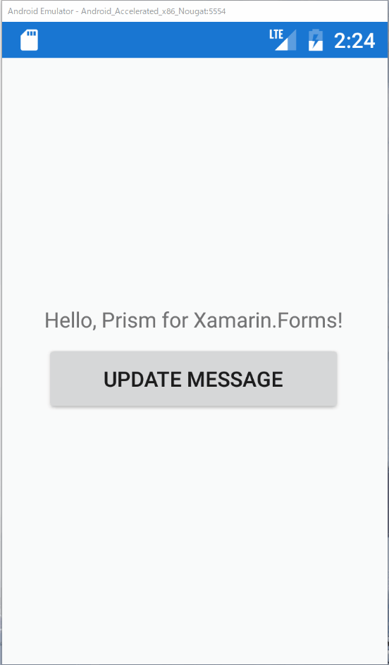

# BindableBaseを利用する

## 目的  

* BindableBaseを利用してINotifyPropertyChangedを簡便に実装する

MVVMパターンでは、画面の状態はViewModelで管理します。この時、ViewModelの値が変わったら、画面の表示状態が変更される必要があります。

このため、ViewModelの状態が変更されたタイミングでViewに変更を通知する必要があります。その為のインターフェースがINotifyPropertyChangedです。

INotifyPropertyChangedの実装は煩雑であるため、PrismではViewModelの基底クラスとしてBindableBaseを提供しており、簡便に実装できるようにしています。

## 手順  

1. MainPageViewModelをBindableBaseが親クラスとなるよう修正する  
2. MainPageViewModelのMessageプロパティの変更通知を実装する  
3. MainPageViewModelのMessageを更新するCommandを作成する  
4. MainPageにボタンを追加し、Messageを更新するCommandをバインドする

## MainPageViewModelをBindableBaseが親クラスとなるよう修正する  

MainPageViewModel.csを開き、BindableBaseが親クラスとなるよう、次のように変更します。

変更前

```cs
namespace PrismHandsOn.ViewModels
{
    public class MainPageViewModel
    {
        ...
```

変更後

```cs
using Prism.Mvvm;

namespace PrismHandsOn.ViewModels
{
    public class MainPageViewModel : BindableBase
    {
        ...
```

## MainPageViewModelのMessageプロパティの変更通知を実装する  

次の手順で実装します。

1. Messageプロパティに対応するバッキングフィールド「_message」を追加
2. Messageプロパティのgetter・setterを明示的に実装  
2. setterではBindableBaseのSetPropertyを呼ぶ

変更前
```cs
    public class MainPageViewModel : BindableBase
    {
        public string Message { get; } = "Hello, Prism for Xamarin.Forms!";
        ...
```

変更後
```cs
    public class MainPageViewModel : BindableBase
    {
        private string _message = "Hello, Prism for Xamarin.Forms!";

        public string Message
        {
            get => _message;
            set => SetProperty(ref _message, value);
        }
        ...
```

BindableBaseのSetPropertyを呼ぶことで、_messageとvalueの値が異なった場合（つまり変更が発生した場合）に、INotifyPropertyChangedで定義されているPropertyChangedが発行され、Viewへ変更が通知されます。

## MainPageViewModelのMessageを更新するCommandを作成する  

つぎのようなコマンドを実装します。

usingが追加になっていることに注意しましょう。

```cs
using System;
using Prism.Mvvm;
using System.Windows.Input;
using Xamarin.Forms;

namespace PrismHandsOn.ViewModels
{
    public class MainPageViewModel : BindableBase
    {
        ...
        public ICommand UpdateMessageCommand => new Command(() => Message = $"Updated on {DateTime.Now}");
    }
}
```

## MainPageにボタンを追加し、Messageを更新するCommandをバインドする

変更前
```xml
<?xml version="1.0" encoding="utf-8" ?>
<ContentPage ...

	<Label Text="{Binding Message}" 
           VerticalOptions="Center" 
           HorizontalOptions="Center" />

</ContentPage>

```

変更前はContentPageの直下にLabelが存在していましたが、ContentPage直下はStackLayoutに変更し、ボタンを追加します。そしてボタンにUpdateMessageCommandをバインドします。

変更後
```cs
<?xml version="1.0" encoding="utf-8" ?>
<ContentPage ...

    <StackLayout HorizontalOptions="Center" VerticalOptions="Center">
        <Label Text="{Binding Message}"/>
        <Button Text="Update Message"
                Command="{Binding UpdateMessageCommand}"/>
    </StackLayout>

</ContentPage>
```
それでは実行してみましょう。表示メッセージが次のように更新されれば実装成功です。



# Next

[EventToCommandBehaviorを使う](05-EventToCommandBehaviorを使う.md)