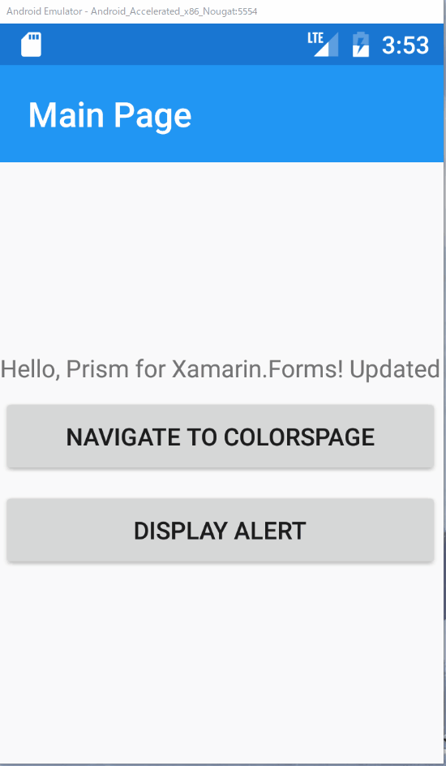

# アラートダイアログの表示

PrismではIPageDialogServiceを利用してAlertや確認ダイアログ、アクションシートを表示する事が出来ます。  

ここではMainPageにボタンを追加し、アラートダイアログを表示するよう実装していきます。

具体的な手順は次の通りです。

1. MainPageViewModelにアラートダイアログを表示するコマンドを追加する
2. MainPageにボタンを追加し、アラートダイアログを表示する

## MainPageViewModelにアラートダイアログを表示するコマンドを追加する

次の手順でアラートダイアログを表示するコマンドを実装します。

1. IPageDialogServiceをフィールドに追加  
2. コンストラクタのパラメーターでIPageDialogServiceを受け取り、フィールドに設定  
3. DisplayAlertCommandを追加し、IPageDialogServiceを利用してアラートダイアログを表示する

変更後
```cs
    public class MainPageViewModel : BindableBase
    {
        private readonly IPageDialogService _pageDialogService;
        ...
        public ICommand DisplayAlertCommand => new Command(() =>
        {
            _pageDialogService.DisplayAlertAsync("Title", "Hello, Dialog.", "OK");
        });


        public MainPageViewModel(INavigationService navigationService, IPageDialogService pageDialogService)
        {
            _navigationService = navigationService;
            _pageDialogService = pageDialogService;
        }
    }
```

## MainPageにボタンを追加し、アラートダイアログを表示する  

MainPage.xamlを開き、StackLayoutの最後にButtonを追加し、DisplayAlertCommandをバインドします。

```xml
<?xml version="1.0" encoding="utf-8" ?>
<ContentPage ...>
    <StackLayout HorizontalOptions="Center" VerticalOptions="Center">
        <Label Text="{Binding Message}"/>
        <Button Text="Navigate to ColorsPage"
                Command="{Binding NavigateCommand}"
                CommandParameter="ColorsPage"/>
        <Button Text="DeepLink" Command="{Binding DeepLinkCommand}"/>
        <Button Text="Display Alert" Command="{Binding DisplayAlertCommand}"/>
    </StackLayout>

</ContentPage>
```

正しく実装できると、次のように動作します。



# Next 

[確認ダイアログの表示](05-02-確認ダイアログの表示.md)  