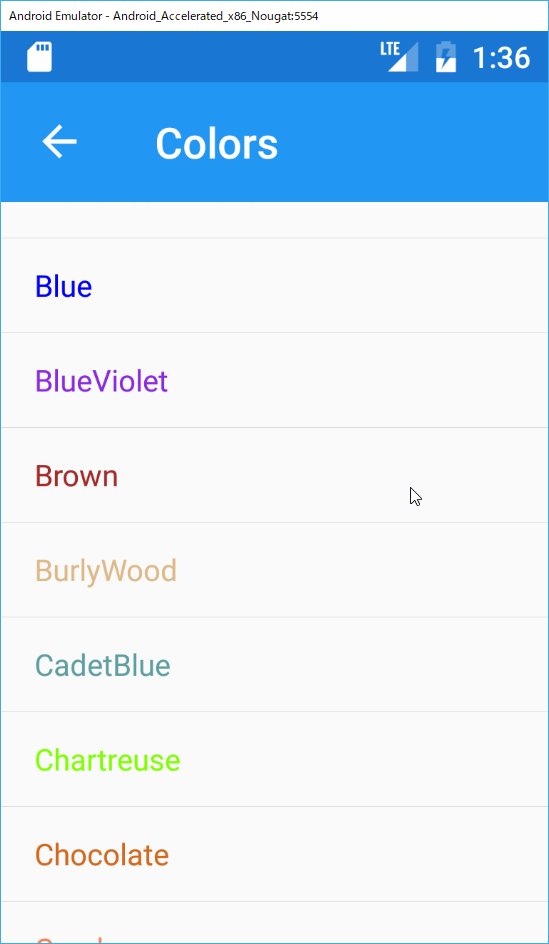
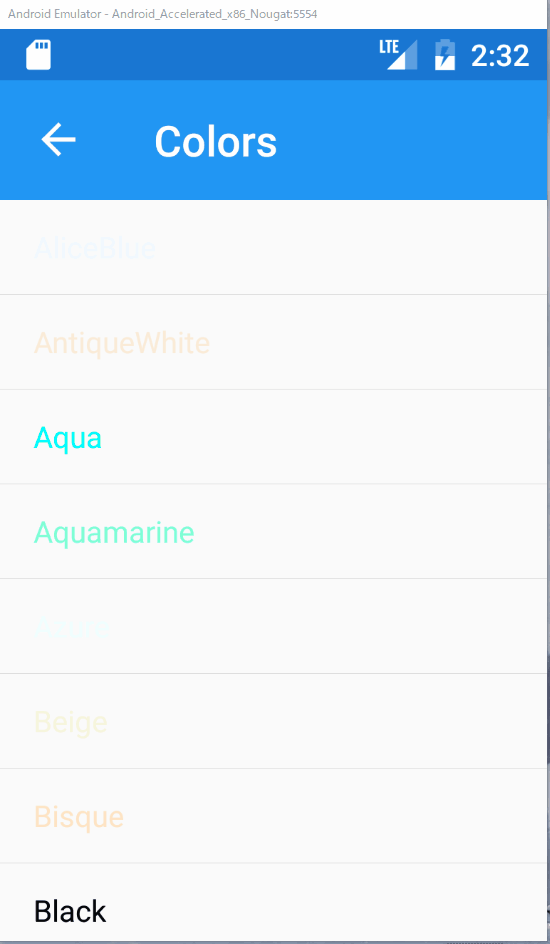

# パラメーターを伴った階層ナビゲーション

## 目的

* 画面遷移時に、遷移先にパラメーターを渡す方法を理解する

ここではListViewから任意の行を選択して、次の画面に選択された行の要素を渡す方法を解説します。

## 手順

1. `ColorsPage`に色の一覧を表示する
2. 遷移先の画面を作成する
3. `ListView`で選択された行をViewModelに受け渡す
4. パラメーターを伴った画面遷移処理を呼び出す
5. 画面遷移先でパラメーターを受け取り画面に表示する

## `ColorsPage`に色の一覧を表示する

先ほど作成した`ColorsPage`にXamarin.Forms.Colorで定義されている色の一覧を表示します。表示する際には色の名称を表示し、色名は実際の色で表示します。

そのため、まずは`ListView`の一行に該当する`ColorInfo`クラスをViewModelsフォルダの下に作成します。

具体的な実装は、次の通りです。

```cs
using Xamarin.Forms;

namespace PrismHandsOn.ViewModels
{
    public class ColorInfo
    {
        public string Name { get; set; }
        public Color Color { get; set; }
    }
}
```

`Xamarin.Forms.Color`構造体は名称は持たないため、名称と`Color`構造体をもつオブジェクトを作成します。

つづいて`ColorsPage`のViewModelを作成します。実装は次の通りです。

```cs
using System.Collections.Generic;
using System.Linq;
using System.Reflection;
using Xamarin.Forms;

namespace PrismHandsOn.ViewModels
{
    public class ColorsPageViewModel
    {
        public IReadOnlyCollection<ColorInfo> ColorInfos { get; } =
            typeof(Color)
                .GetRuntimeFields()
                .Where(x => x.IsPublic && x.IsStatic && x.FieldType == typeof(Color))
                .Select(x => new ColorInfo { Name = x.Name, Color = (Color)x.GetValue(null) })
                .ToList();
    }
}
```

リフレクションで`Xamarin.Forms.Color`構造体に定義されているpublic staticなフィールドをすべて取得し、`ColorInfo`オブジェクトを作成し、`List`に変換しています。

この`ColorInfos`プロパティを`ListView`にバインドします。

`ColorsPage.xaml`を開き、つぎのように修正しましょう。

```xml
<?xml version="1.0" encoding="utf-8" ?>
<ContentPage xmlns="http://xamarin.com/schemas/2014/forms"
             xmlns:x="http://schemas.microsoft.com/winfx/2009/xaml"
             x:Class="PrismHandsOn.Views.ColorsPage"
             Title="Colors">
    <ListView ItemsSource="{Binding ColorInfos}">
        <ListView.ItemTemplate>
            <DataTemplate>
                <TextCell Text="{Binding Name}" TextColor="{Binding Color}"/>
            </DataTemplate>
        </ListView.ItemTemplate>
    </ListView>
</ContentPage>
```

`ListView`を定義し、その`ItemsSource`にViewModelで定義した`ColorInfos`プロパティをバインドします。

`ListView`の各行は`TextCell`で定義し、表示文字列に`ColorInfo`の`Name`プロパティを、`TextColor`に`ColorInfo`プロパティの`Color`プロパティを設定します。

ここで一度実行して動作を確認しましょう。次のような画面が表示されれば成功です。



## 遷移先の画面を作成する  

つづいて、`ListView`で行が選択された後、遷移する先の画面を先に作ります。

まずはViewModel、`SelectedItemPageViewModel.cs`を次のように作成します。

```cs
using System;
using System.Reflection;
using Prism.Mvvm;
using Xamarin.Forms;

namespace PrismHandsOn.ViewModels
{
    public class SelectedItemPageViewModel : BindableBase
    {
        private string _colorName;

        private Color _color;

        public string ColorName
        {
            get => _colorName;
            set => SetProperty(ref _colorName, value);
        }

        public Color Color
        {
            get => _color;
            set => SetProperty(ref _color, value);
        }
    }
}
```

選択された`ColorInfo`を保持するプロパティを作成し、それが変更されたら通知されるよう実装します。

つづいてViewである`SelectedItemPage.xaml`です。

```xml
<?xml version="1.0" encoding="utf-8" ?>
<ContentPage xmlns="http://xamarin.com/schemas/2014/forms"
             xmlns:x="http://schemas.microsoft.com/winfx/2009/xaml"
             x:Class="PrismHandsOn.Views.SelectedItemPage"
             Title="Selected Item">
    <Label Text="{Binding ColorName}"
           TextColor="{Binding Color}"
           VerticalOptions="Center" 
           HorizontalOptions="Center" />
</ContentPage>
```

`Label`に選択された色の名称を、選択された色で表示するように実装します。ViewModelの`ColorName`と`Color`プロパティを設定しています。

`Title`宣言を忘れないよう注意しましょう。

新しくページを作成したら、`App.xaml.cs`でDIコンテナへ登録するのを忘れないようにしましょう。

```cs
        protected override void RegisterTypes(IContainerRegistry containerRegistry)
        {
            containerRegistry.RegisterForNavigation<NavigationPage>();
            containerRegistry.RegisterForNavigation<MainPage>();
            containerRegistry.RegisterForNavigation<ColorsPage>();
            containerRegistry.RegisterForNavigation<SelectedItemPage>();
        }
```

## `ListView`で選択された行をViewModelに受け渡す  

それでは、`ListView`で選択された行をViewModelに通知する実装を行います。

`ListView`で選択された行を通知するためには、先にも説明した`EventToCommandBehavior`を利用し、`ListView`で`ItemSelected`イベントが発生した際に、選択された`ColorInfo`をViewModelに定義する`ItemSelectedCommand`に渡すように実装します。

まずはXAML側です。

変更前

```xml
<?xml version="1.0" encoding="utf-8" ?>
<ContentPage xmlns="http://xamarin.com/schemas/2014/forms"
             xmlns:x="http://schemas.microsoft.com/winfx/2009/xaml"
             x:Class="PrismHandsOn.Views.ColorsPage"
             Title="Colors">
    <ListView ItemsSource="{Binding ColorInfos}">
        <ListView.ItemTemplate>
            <DataTemplate>
                <TextCell Text="{Binding Name}" TextColor="{Binding Color}"/>
            </DataTemplate>
        </ListView.ItemTemplate>
    </ListView>
</ContentPage>
```

この`ListView`の下に`EventToCommandBehavior`を追加します。
ContentPageの属性に「xmlns:behaviors=～」の宣言を追加するのを忘れないように注意しましょう。

変更後

```xml
<?xml version="1.0" encoding="utf-8" ?>
<ContentPage xmlns="http://xamarin.com/schemas/2014/forms"
             xmlns:x="http://schemas.microsoft.com/winfx/2009/xaml"
             xmlns:behaviors="clr-namespace:Prism.Behaviors;assembly=Prism.Forms"
             x:Class="PrismHandsOn.Views.ColorsPage"
             Title="Colors">
    <ListView ItemsSource="{Binding ColorInfos}">
        <ListView.Behaviors>
            <behaviors:EventToCommandBehavior EventName="ItemSelected" 
                                              Command="{Binding ItemSelectedCommand}"
                                              EventArgsParameterPath="SelectedItem"/>
        </ListView.Behaviors>
        <ListView.ItemTemplate>
            <DataTemplate>
                <TextCell Text="{Binding Name}" TextColor="{Binding Color}"/>
            </DataTemplate>
        </ListView.ItemTemplate>
    </ListView>
</ContentPage>
```

注目してもらいたいのは、`EventToCommandBehavior`の`EventArgsParameterPath`プロパティです。

Prismでは、`EventToCommandBehavior`に`EventArgsParameterPath`を指定すると、`EventName`で宣言されたイベントが発生した際、そのイベントオブジェクトのプロパティの内、`EventArgsParameterPath`で指定された名称と合致するプロパティをCommandにパラメーターとして渡してくれます。

今回の場合、`ItemSelected`を待ち受けています。`ItemSelected`はイベント発生時にイベント引数として[SelectedItemChangedEventArgs](https://developer.xamarin.com/api/type/Xamarin.Forms.SelectedItemChangedEventArgs/)が渡されます。

`SelectedItemChangedEventArgs`では、`ListView`で選択された行にバインドされているオブジェクト（今回は`ColorInfo`）が`SelectedItem`プロパティに設定されてくるため、その値を取得して`ItemSelectedCommand`を呼び出しています。

それでは、そのコマンドを実装しましょう。

## パラメーターを伴った画面遷移処理を呼び出す  

`ColorsPageViewModel.cs`を開き次の実装を行います。

1. `INavigationService`フィールドの追加  
2. コンストラクタで`INavigationService`を引数で受け取りフィールドへ設定  
3. `ItemSelectedCommand`の実装

```cs
    public class ColorsPageViewModel
    {
        ...

        private readonly INavigationService _navigationService;

        public Command<ColorInfo> ItemSelectedCommand => 
            new Command<ColorInfo>(colorInfo =>
            {
                var parameter = new NavigationParameters();
                parameter.Add("colorName", colorInfo.Name);
                _navigationService.NavigateAsync(nameof(SelectedItemPage), parameter);
            });

        public ColorsPageViewModel(INavigationService navigationService)
        {
            _navigationService = navigationService;
        }
    }
```

`ItemSelectedCommand`プロパティの実装を見てください。
`INavigationService`の`NavigateAsync`を呼び出す際に、`NavigationParameters`を第二引数で渡すことで、次の画面にパラメーターを渡すことができます。このとき選択された行に対応する`ColorInfo`から色名を取得してパラメーターとして渡しています。

Prismではパラメーターの受け渡しに複数の方法を提供しています。

ここでは`ColorInfo`オブジェクトを渡すため、`NavigationParameters`の`Add`メソッドで選択された行の`ColorInfo`オブジェクトを設定していますが、例えば次のようにURLライクに記述することで、遷移名にパラメーターを含めて指定することもできます。

```cs
 _navigationService.NavigateAsync(
     $"{nameof(SelectedItemPage)}?colorName={colorInfo.Name}");
```

アプリケーションがバックグラウンドに移って、メモリから退避されたあと、再度復旧するような場合、画面遷移に用いたパラメーターは何らかの方法でシリアライズして保存しておき、復帰時にその値で再度元の画面に再遷移する必要があるかもしれません。

その場合は、オブジェクトを渡すパターンではなく、文字列でパラメーターをシリアライズしておくと、画面スタックの再生成が楽になるかもしれません。

## 画面遷移先でパラメーターを受け取り画面に表示する

それでは最後に、遷移先の画面で渡されたパラメーターを受け取って、画面に表示するよう実装しましょう。

`SelectedItemPageViewModel`に`INavigatingAware`インターフェースを実装することで値を受け取ります。

```cs
    public class SelectedItemPageViewModel : BindableBase, INavigatingAware
    {
        ...
        public void OnNavigatingTo(NavigationParameters parameters)
        {
            ColorName = (string) parameters["colorName"];
            Color = (Color) typeof(Color).GetRuntimeField(ColorName).GetValue(null);
        }
    }
```

`GetRuntimeField`は拡張メソッドのため、`System.Reflection`のusing宣言を忘れないよう注意してください。

`INavigatingAware`の`OnNavigatingTo`メソッドは、画面遷移時に遷移先の画面の表示前に呼び出される、言わば画面表示の準備イベントハンドラです。ここで渡されたパラメーターを取得してプロパティに設定します。

これで完成です。うまく実装できていれば、次のように動作するはずです。



Prismではこれ以外にも、画面遷移のタイミングに合わせてイベントを受け取るためのインターフェースが複数用意されています。

|インターフェース|メソッド|役割|
|:--|:--|:--|
|IConfirmNavigation|CanNavigate|画面遷移前に呼び出されfalseを返す事で遷移をブロックできる。<br>ただし、NavigationPageで戻る際にはXamarin.Formsの仕様上動作しないため要注意。|
|IConfirmNavigationAsync|CanNavigateAsync|CanNavigateの非同期版。<br>ConfirmDialogなどでユーザーインタラクションの結果を受けて、遷移の可否を決定する場合などに利用する。|
|IDestructible|Destroy|Pageが破棄されるタイミングで呼ばれる。イベントハンドラの購読解除などに利用する。|
|INavigatedAware|OnNavigatedFrom|画面遷移後に、遷移元の画面で呼ばれる。ViewやViewModelの状態を非活性な状態にするために利用する。|
||OnNavigatedTo|画面遷移後に、遷移先の画面で呼ばれる。次のものと違い、遷移後に呼ばれるためここで画面表示を変更すると、変更処理がユーザーに見えることになる。|
|INavigatingAware|OnNavigatingTo|画面遷移前に、遷移先の画面で呼ばれる。画面の初期化に利用すると良い。|

これらのメソッドはViewもしくはViewModelのいずれでも利用可能です。

# Next

[前の画面へ戻る](06-04-前の画面へ戻る.md)  
