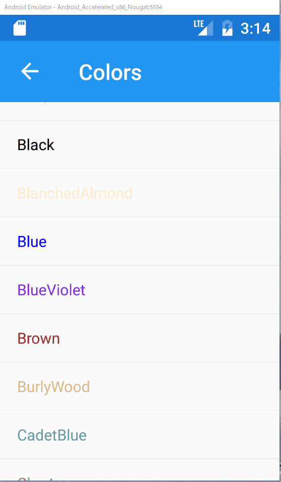

# 前の画面へ戻る

## 目的

* C#のコードから前画面へ戻る処理を実装する

ここまでの実装では`NavigationPage`を利用した画面遷移を行ってきたため、ナビゲーションバーから前の画面へ戻ることができました。

ここではナビゲーションバーではなく、ViewModelから明示的に前の画面へ戻る処理を実装していきます。

## 手順

1. ViewModelへ戻る処理を実装したCommandを追加する
2. 画面にボタンを追加し、押下時に1.のCommandを実行する

ここでは、`SelectedItemPage`から`ColorsPage`へ戻るよう実装していきます。

## ViewModelへ戻る処理を実装したCommandを追加する  

まずは`SelectedItemPageViewModel.cs`を開いて、戻る処理を実装します。

次の手順で実装します。

1. `INavigationService`をフィールドへ追加
2. コンストラクタの引数で`INavigationService`を受け取り、フィールドへ設定
3. `GoBackCommand`の実装

```cs
    public class SelectedItemPageViewModel : BindableBase, INavigatingAware
    {
        private readonly INavigationService _navigationService;

        ...

        public ICommand GoBackCommand => 
            new Command(() => _navigationService.GoBackAsync());

        public SelectedItemPageViewModel(INavigationService navigationService)
        {
            _navigationService = navigationService;
        }
        ...
    }
```

戻る処理の実装は簡単です。

`INavigationService`の`GoBackAsync`を呼び出すだけです。

## 画面にボタンを追加し、押下時に1.のCommandを実行する

つづいて、`SelectedItemPage.xaml`を開いてボタンを追加し、先に追加した`GoBackCommand`をバインドしましょう。

```xml
<?xml version="1.0" encoding="utf-8" ?>
<ContentPage xmlns="http://xamarin.com/schemas/2014/forms"
             xmlns:x="http://schemas.microsoft.com/winfx/2009/xaml"
             x:Class="PrismHandsOn.Views.SelectedItemPage"
             Title="Selected Item">
    <StackLayout HorizontalOptions="Center" VerticalOptions="Center">
        <Label Text="{Binding ColorName}"
               TextColor="{Binding Color}"/>
        <Button Text="GoBack" Command="{Binding GoBackCommand}"/>
    </StackLayout>
</ContentPage>
```

`StackLayout`を追加して、その下にラベルとボタンを配置しています。

ボタンのCommandプロパティには`GoBackCommand`がバインドされています。

これを実装すれば、次のように前画面へ戻れるようになります。



# Next

[プラットフォーム固有実装を利用する](07-01-01-プラットフォーム固有実装を利用する.md)