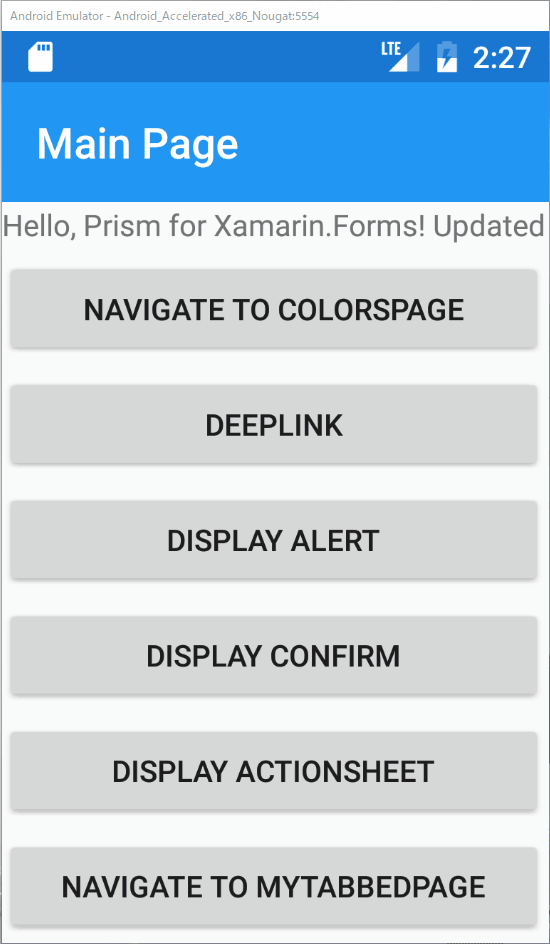
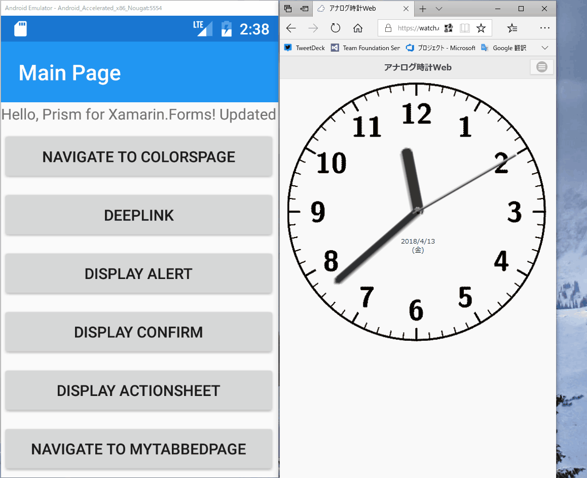

# TabbedPageを扱う

正確にはTabbedPageだけでなく、CarouselPageを含めた、これらの親クラスに共通する話題です。PrismではこれらのPageでアクティブな子ページが変更されたイベントをハンドルする仕組みが提供されています。

ここではTabbedPageを例に、タブが活性状態の変化をハンドルする方法を解説・実装していきます。

次の手順で実装していきます。

1. 子PageとそのViewModelを作成する  
2. TabbedPageの実装クラスを作成する  
3. MainPageからの画面遷移を実装する  
4. 子Pageでタブが活性状態の変化をハンドリングする

# 子PageとそのViewModelを作成する  

ChildPage.xamlと、ChildPageViewModel.csをそれぞれViewsフォルダとViewModelsフォルダの下に作成します。

ひとまずは、アイテムテンプレートから生成したそのままで問題ありません。

App.xaml.csでDIコンテナへChildPageを登録するのを忘れないようにしましょう。

```cs
protected override void RegisterTypes(IContainerRegistry containerRegistry)
{
    ...
    containerRegistry.RegisterForNavigation<ChildPage>();
}
```

2. TabbedPageの実装クラスを作成する  

Viewsフォルダの下にTabbedPageを継承したMyTabbedPageを作成します。

```xml
<?xml version="1.0" encoding="utf-8" ?>
<TabbedPage xmlns="http://xamarin.com/schemas/2014/forms"
            xmlns:x="http://schemas.microsoft.com/winfx/2009/xaml"
            xmlns:prism="clr-namespace:Prism.Mvvm;assembly=Prism.Forms"
            xmlns:views="clr-namespace:PrismHandsOn.Views;assembly=PrismHandsOn"
            prism:ViewModelLocator.AutowireViewModel="True"
            x:Class="PrismHandsOn.Views.MyTabbedPage"
            Title="My Tabbed Page">
    <views:ChildPage Title="Tab A"/>
    <views:ChildPage Title="Tab B"/>
</TabbedPage>
```

Tab AとTab Bの二つのタブを持ち、どちらもChildPageが設定されています。

こちらも先ほどと同様に、DIコンテナへの登録を忘れないようにしましょう。

```cs
protected override void RegisterTypes(IContainerRegistry containerRegistry)
{
    ...
    containerRegistry.RegisterForNavigation<MyTabbedPage>();
}
```

3. MainPageからの画面遷移を実装する  

MainPage.xamlにボタンを追加し、先に作成したNavigateCommandを利用してMyTabbedPageへ遷移するよう実装します。

```xml
<?xml version="1.0" encoding="utf-8" ?>
<ContentPage ...
    <StackLayout HorizontalOptions="Center" VerticalOptions="Center">
        ...
        <Button Text="Navigate to MyTabbedPage" 
                Command="{Binding NavigateCommand}" 
                CommandParameter="MyTabbedPage"/>
    </StackLayout>
</ContentPage>
```

さて、これで取り合えずはタブが動作するはずです。ビルドして動作を確認してみましょう。

正しく実装されていれば、次のように動作します。



4. 子Pageでタブが活性状態の変化をハンドリングする

つづいて、タブの活性状態をハンドリングする実装を行います。

具体的にはChildPageにListViewを追加し、タブがアクティブになったら、その時間をListViewに追加していくようにします。

まずはChildPageViewModel.csを開き、次のように実装しましょう。

```cs
using Prism.Mvvm;
using System;
using System.Collections.ObjectModel;
using Prism;

namespace PrismHandsOn.ViewModels
{
	public class ChildPageViewModel : BindableBase, IActiveAware
	{
	    public ObservableCollection<DateTime> ActiveTimes { get; } = 
            new ObservableCollection<DateTime>();

	    private bool _isActive;

	    public bool IsActive
	    {
	        get => _isActive;
	        set
	        {
	            if (SetProperty(ref _isActive, value) && _isActive)
	                ActiveTimes.Add(DateTime.Now);
	        }
	    }

	    public event EventHandler IsActiveChanged;
    }
}
```

タブの活性状態の切り替えをハンドルするためには、IActiveAwareインターフェースを実装します。

IActiveAwareには、IsActiveプロパティと、IsActiveChangedイベントが定義されています。

```cs
public interface IActiveAware
{
    bool IsActive { get; set; }
    event EventHandler IsActiveChanged;
}
```

タブの活性状態が変更されると、対象のタブのViewもしくはViewModelにIActiveAwareが実装されていると、そのIsActiveが変更されることで状態変化を通知されます。

先のChildPageViewModelの実装をもう一度確認してみてください。

IsActiveプロパティのsetの中で、IsActiveがtrueに変更されたときにActiveTimesに現在時間を追加するように実装しています。

最後に、このActiveTimesをChildPageにListViewを追加してバインドしましょう。

```xml
<?xml version="1.0" encoding="utf-8" ?>
<ContentPage xmlns="http://xamarin.com/schemas/2014/forms"
             xmlns:x="http://schemas.microsoft.com/winfx/2009/xaml"
             xmlns:prism="clr-namespace:Prism.Mvvm;assembly=Prism.Forms"
             prism:ViewModelLocator.AutowireViewModel="True"
             x:Class="PrismHandsOn.Views.ChildPage">
    <ListView ItemsSource="{Binding ActiveTimes}"/>
</ContentPage>
```

それでは実行してみましょう。

切り替えてタブが表示自体に変化するタイミングでListViewに行が追加されていることが見て取れます。



# Next

[演習問題](90.演習問題.md)
