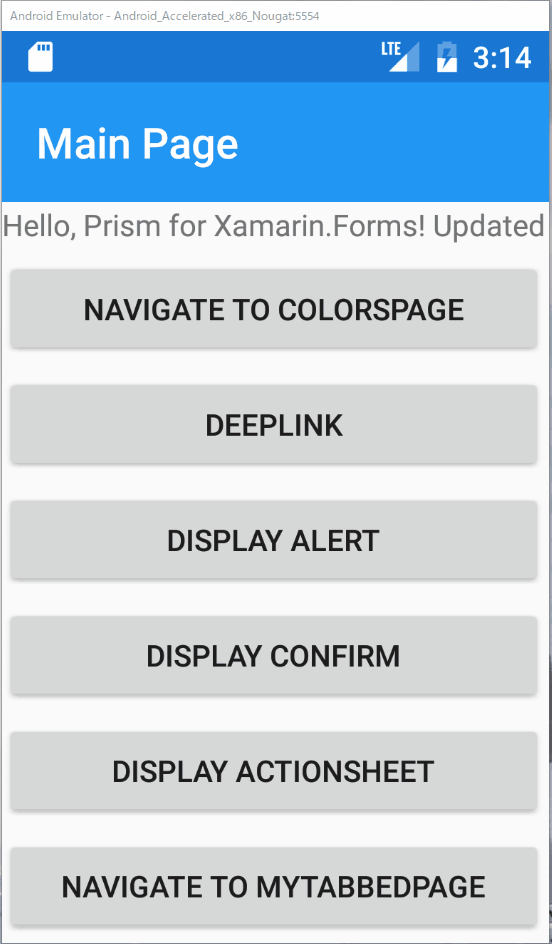

# DeepLinkを利用する

## 目的  

* 一挙動で複数画面分遷移するDeepLinkの実装を理解する

Prismでは、深い画面まで一度に遷移するためのDeepLinkの機能がサポートされています。この機能の利用シーンは、例えば次の３パターンが想定されます。

1. ショッピングアプリなどで、URLから起動して直接対象商品の詳細ページを開きたい  
2. アプリケーションがスリープ状態から復帰した時に、元々開かれていた画面を開き直したい  
3. アプリケーションで現時点で開いている遷移ツリーから、別の遷移ツリーに一気に移動したい 　

ここではMainPage > ColorPage > SelectedItemPageと一気に遷移するよう実装します。
その際に、赤色が選択されたものとして遷移することとします。

## 手順

* MainPageViewModelにDeepLinkを実装したCommandを追加する 　
* MainPageにボタンを追加し、DeepLinkを呼び出す

## MainPageViewModelにDeepLinkを実装したCommandを追加する 　

MainPageViewModel.csを開き、次のようなコマンドを実装します。

```cs
public ICommand DeepLinkCommand =>
    new Command(() => 
        _navigationService.NavigateAsync(
            $"{nameof(ColorsPage)}/{nameof(SelectedItemPage)}?colorName=Red"));
```

遷移名をスラッシュで区切って複数指定することで、深い画面までのリンクを指定することができます。
その際に、中間のページにも例えば次のようにパラメーターを渡すことも可能です。

```txt
PageA?paramA=valueA/PageB?paramB1=valueB1&paramB2=valueB2
```

## MainPageにボタンを追加し、DeepLinkを呼び出す

MainPage.xamlを開き、Labelの下に先に定義したDeepLinkCommandをバインドしたボタンを定義します。

```xml
<?xml version="1.0" encoding="utf-8" ?>
<ContentPage ...
    <StackLayout HorizontalOptions="Center" VerticalOptions="Center">
        <Label Text="{Binding Message}"/>
        <Button Text="Update Message"
                Command="{Binding UpdateMessageCommand}"/>
        <Button Text="Navigate to ColorsPage"
                Command="{Binding NavigateCommand}"
                CommandParameter="ColorsPage"/>
        <Button Text="DeepLink" Command="{Binding DeepLinkCommand}"/>
```

それでは実行して見ましょう。

ボタンを押下するとSelectedItemPageまで一気に遷移し、戻る際にはちゃんと1ページずつ戻っていることが見て取れるかと思います。



# Next

[絶対パス遷移を利用する](08-02-絶対パス遷移を利用する.md)