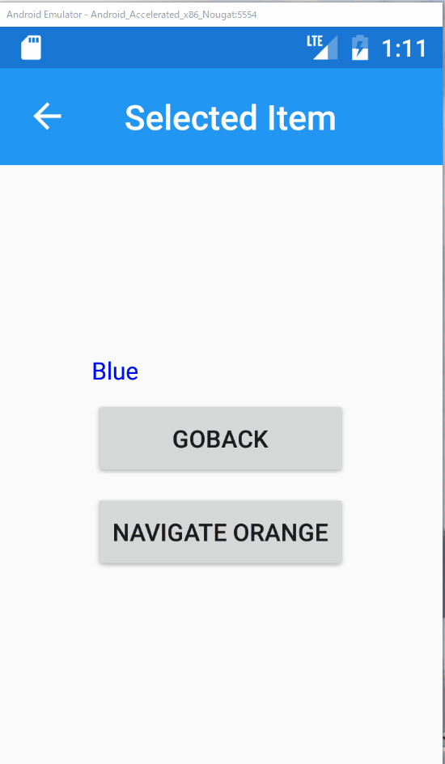

# 絶対パス遷移を利用する

DeepLinkの説明の際に、使用例として次のような説明をしました。

> アプリケーションで現時点で開いている遷移ツリーから、別の遷移ツリーに一気に移動したい 　

このシナリオの場合、先ほど説明したDeepLinkだけでは実現できません。

Prismではアプリケーションの画面遷移状態を一度クリアして先頭から再遷移するための、遷移先の絶対パス指定が可能です。

ここではSelectedItemPageを表示している状態から、同一ページで別の色を再表示するよう、絶対パスなDeepLinkを行います。

具体的な手順は次の通りです。

1. SelectedItemPageViewModelにDeepLinkのためのコマンドを実装する  
2. SelectedItemPageに上記コマンドを実行するボタンを追加する

# SelectedItemPageViewModelにDeepLinkのためのコマンドを実装する  

SelectedItemPageViewModel.csに新しいコマンドを追加します。

```cs
public ICommand NavigateOrangeCommand =>
    new Command(() => 
        _navigationService.NavigateAsync(
            $"/{nameof(NavigationPage)}/{nameof(MainPage)}/{nameof(ColorsPage)}/{nameof(SelectedItemPage)}?colorName=Orange"));
```

遷移名の指定をスラッシュから始めることで、現在のナビゲーションスタック（画面遷移の状態）を全て破棄して、最初から再遷移します。

NavigationPageを利用している場合、改めてその指定が必要なことに注意しましょう。

今回は、Orangeが選択された状態で改めてSelectedItemPageが表示されるよう指示しています。

# SelectedItemPageに上記コマンドを実行するボタンを追加する

SelectedItemPage.xamlを開き、新たにボタンを追加してください。

```xml
<ContentPage ...>
    <StackLayout HorizontalOptions="Center" VerticalOptions="Center">
        <Label Text="{Binding ColorName}"
               TextColor="{Binding Color}"/>
        <Button Text="GoBack" Command="{Binding GoBackCommand}"/>
        <Button Text="Navigate Orange" Command="{Binding NavigateOrangeCommand}"/>
        ...
```

以上で実装は終了です。

正しく実装できていれば、次のように動作するはずです。



# Next

[アラートダイアログの表示](05-01-アラートダイアログの表示.md)  
