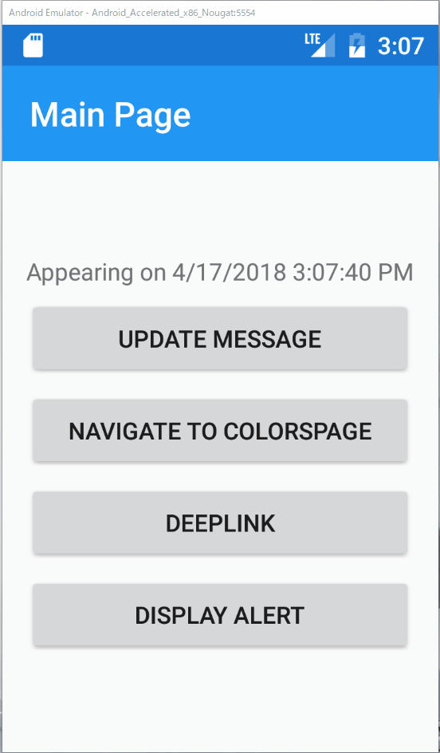

# アラートダイアログの表示

## 目的

* アラートダイアログの表示方法を理解する

Prismでは`IPageDialogService`を利用してAlertや確認ダイアログ、アクションシートを表示する事が出来ます。  

ここでは`MainPage`にボタンを追加し、アラートダイアログを表示するよう実装していきます。

## 手順

1. `MainPageViewModel`にアラートダイアログを表示するコマンドを追加する
2. `MainPage`にボタンを追加し、アラートダイアログを表示する

## `MainPageViewModel`にアラートダイアログを表示するコマンドを追加する

次の手順でアラートダイアログを表示するコマンドを実装します。

1. `IPageDialogService`をフィールドに追加  
2. コンストラクタのパラメーターで`IPageDialogService`を受け取り、フィールドに設定  
3. `DisplayAlertCommand`を追加し、`IPageDialogService`を利用してアラートダイアログを表示する

変更後

```cs
    public class MainPageViewModel : BindableBase
    {
        private readonly IPageDialogService _pageDialogService;
        ...
        public ICommand DisplayAlertCommand => new Command(() =>
        {
            _pageDialogService.DisplayAlertAsync("Title", "Hello, Dialog.", "OK");
        });


        public MainPageViewModel(INavigationService navigationService, IPageDialogService pageDialogService)
        {
            _navigationService = navigationService;
            _pageDialogService = pageDialogService;
        }
    }
```

## `MainPage`にボタンを追加し、アラートダイアログを表示する

`MainPage.xaml`を開き、`StackLayout`の最後に`Button`を追加し、`DisplayAlertCommand`をバインドします。

```xml
<?xml version="1.0" encoding="utf-8" ?>
<ContentPage ...>
    <StackLayout HorizontalOptions="Center" VerticalOptions="Center">
        <Label Text="{Binding Message}"/>
        <Button Text="Update Message"
                Command="{Binding UpdateMessageCommand}"/>
        <Button Text="Navigate to ColorsPage"
                Command="{Binding NavigateCommand}"
                CommandParameter="ColorsPage"/>
        <Button Text="DeepLink" Command="{Binding DeepLinkCommand}"/>
        <Button Text="Display Alert" Command="{Binding DisplayAlertCommand}"/>
    </StackLayout>

</ContentPage>
```

正しく実装できると、次のように動作します。



# Next 

[確認ダイアログの表示](09-02-確認ダイアログの表示.md)  