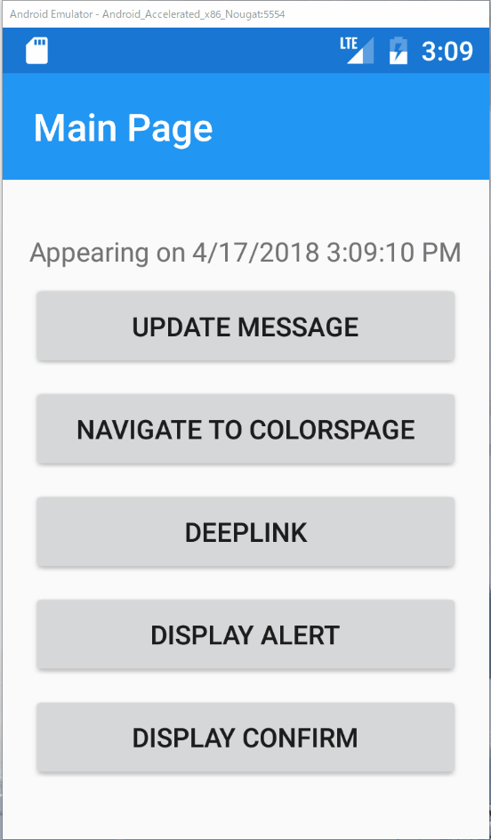

# 確認ダイアログの表示

さて、先ほどはアラートダイアログを表示しましたが、今度は確認ダイアログを表示するよう実装していきます。

具体的な手順は次の通りです。

1. `MainPageViewModel`に確認ダイアログを表示するコマンドを追加する
2. `MainPage`にボタンを追加し、確認ダイアログを表示する

## `MainPageViewModel`に確認ダイアログを表示するコマンドを追加する

次のように、確認ダイアログを表示するコマンドを実装します。

変更後

```cs
public ICommand DisplayConfirmCommand => new Command(async () =>
{
    var result = await _pageDialogService.DisplayAlertAsync(
        "Title", "何れかを選んでください。", "はい", "いいえ");
    Message = $"Selected:{result}";
});
```

確認ダイアログを表示し、選択結果のbool値を`Message`プロパティに表示します。

## `MainPage`にボタンを追加し、確認ダイアログを表示する  

`MainPage.xaml`を開き、`StackLayout`の最後に`Button`を追加し、`DisplayConfirmCommand`をバインドします。

```xml
<?xml version="1.0" encoding="utf-8" ?>
<ContentPage ...>
    <StackLayout HorizontalOptions="Center" VerticalOptions="Center">
        <Label Text="{Binding Message}"/>
        <Button Text="Update Message"
                Command="{Binding UpdateMessageCommand}"/>
        <Button Text="Navigate to ColorsPage"
                Command="{Binding NavigateCommand}"
                CommandParameter="ColorsPage"/>
        <Button Text="DeepLink" Command="{Binding DeepLinkCommand}"/>
        <Button Text="Display Alert" Command="{Binding DisplayAlertCommand}"/>
        <Button Text="Display Confirm" Command="{Binding DisplayConfirmCommand}"/>
    </StackLayout>

</ContentPage>
```

正しく実装できると、次のように動作します。

`DisplayConfirmCommand`メソッドの第一引数がダイアログのタイトルに、第二引数がメッセージに、第三引数がポジティブボタンのラベルに、第四引数がネガティブボタンのラベルになっているのが見て取れます。



# Next

[アクションシートの表示](09-03-アクションシートの表示.md)  