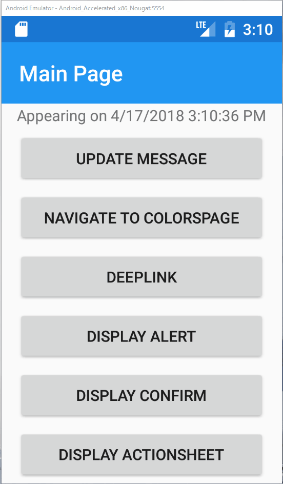

# アクションシートの表示

Xamarin.FormsではiOSのアクションシートのように、複数選択を促すダイアログをAndroidや他のプラットフォームに対しても標準で用意しています。


PrismではこのアクションシートをMVVMパターンの中で簡単に利用できるサービスを提供しています。

ここではアクションシートについて実装していきます。

アクションシートを表示するAPIは2種類用意されています。

一つ目は、選択肢などをすべて文字列で指定して、選択結果をその文字列で取得する方法です。

```cs
Task<string> DisplayActionSheetAsync(
    string title, string cancelButton, string destroyButton, params string[] otherButtons);
```

二つ目は、IActionSheetButtonを利用する方法です。

```cs
Task DisplayActionSheetAsync(string title, params IActionSheetButton[] buttons);
```

ここではこれらを次の順で実装していき、違いを理解していただきます。

1. 文字列指定によるアクションシートの表示  
1. IActionSheetButton指定によるアクションシートの表示  

## 文字列指定によるアクションシートの表示  

次の手順で実装します。

1. アクションシートを表示するコマンドのViewModelへの追加  
2. コマンドをバインドしたボタンのViewへの追加

### MainPageViewModel.csにアクションシート表示コマンドの追加  

アクションシートを表示し、選択結果を画面に表示するコマンドを追加します。  

```cs
public ICommand DisplayActionSheetCommand => new Command(async () =>
{
    var result = 
        await _pageDialogService.DisplayActionSheetAsync(
            "共有先を選択してください。", "キャンセル", "削除", "Twitter", "LINE", "Facebook");
    Message = $"Selected:{result}";
});
```

### MainPage.xamlへアクションシート表示ボタンの追加  

「Display Confirm」のボタンの下へ、新しいボタンを追加しまします。  
```xml
<Button Text="Display ActionSheet" Command="{Binding DisplayActionSheetCommand}"/>
```

これで実装は完了です。正しく実装されていれば、次のように動作するはずです。
選択された文字列が、MainPage先頭のLabelに表示されているのが見て取れます。




## IActionSheetButton指定によるアクションシートの表示  

つづいてIActionSheetButtonを利用してアクションシートを表示するよう、実装を修正していきます。

MainPageViewModel.csを開き、先ほど作成したDisplayActionSheetCommandを修正し、併せてアクションシート選択時のイベントハンドラを追記してください。

```cs
public ICommand DisplayActionSheetCommand => new Command(() =>
{
    _pageDialogService.DisplayActionSheetAsync(
        "共有先を選択してください。",
        ActionSheetButton.CreateCancelButton("キャンセル", OnCancel),
        ActionSheetButton.CreateDestroyButton("削除", OnDestory),
        ActionSheetButton.CreateButton("Twitter", OnSelectTwitter),
        ActionSheetButton.CreateButton("LINE", OnSelectLine),
        ActionSheetButton.CreateButton("Facebook", OnSelectFacebook));
});

private void OnCancel() => Message = "Selected:キャンセル";
private void OnDestory() => Message = "Selected:削除";
private void OnSelectTwitter() => Message = "Selected:Twitter";
private void OnSelectLine() => Message = "Selected:LINE";
private void OnSelectFacebook() => Message = "Selected:Facebook";

```

動作は全く変わりませんし、このミニマムな実装を見ると先ほどの実装の方がシンプルに見えるかも知れません。しかし実際には多くのケースでIActionSheetButtonを利用する形式を採用するべきです。

アクションシートを表示した場合、選択された要素によって実行する内容は全く異なるケースが多いはずです。

したがって、先の文字列指定の方式の場合、選択結果を文字列で受け取った後にIF分で処理分岐をする必要があります。

しかしIActionSheetButtonを利用した場合は、最初から選択にあわせて実行する内容をActionとして登録しておくことが可能で、条件分岐を記述する必要がありません。

このため、プロダクトレベルのコードではIActionSheetButtonを利用した方がシンプルになりますし、分岐の実装誤りを防ぐこともできます。

明確な理由がない限りはIActionSheetButtonを利用する方式を採用した方が良いでしょう。

なおIActionSheetButtonの作成方法は、他にも多数ありますので直接確認して適切なものを選んでください。

* [ActionSheetButton.cs](https://github.com/PrismLibrary/Prism/blob/master/Source/Xamarin/Prism.Forms/Services/PageDialogService/ActionSheetButton.cs)

# Next

[TabbedPageを扱う](10-TabbedPageを扱う.md)