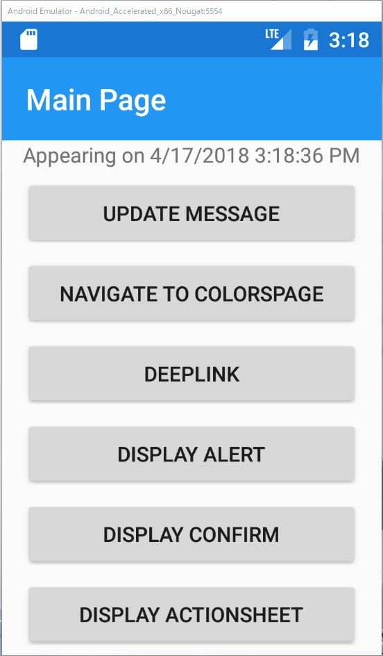
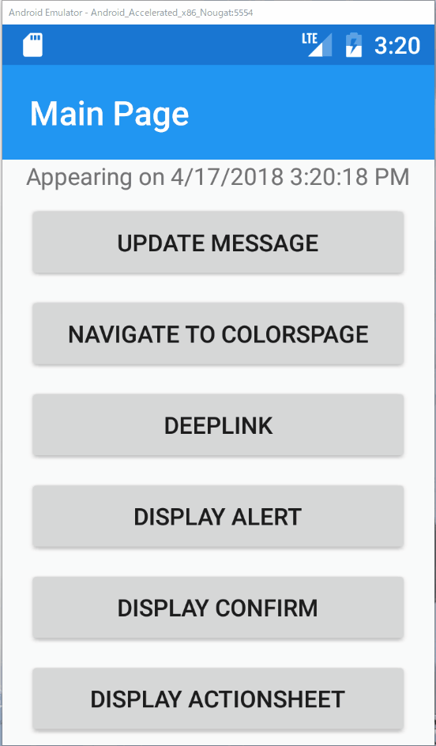

# `TabbedPage`を扱う

正確には`TabbedPage`だけでなく、`CarouselPage`を含めた、これらの親クラスに共通する話題です。PrismではこれらのPageでアクティブな子ページが変更されたイベントをハンドルする仕組みが提供されています。

ここでは`TabbedPage`を例に、タブが活性状態の変化をハンドルする方法を解説・実装していきます。

次の手順で実装していきます。

1. 子PageとそのViewModelを作成する
2. `TabbedPage`の実装クラスを作成する
3. `MainPage`からの画面遷移を実装する
4. 子Pageでタブが活性状態の変化をハンドリングする

## 子PageとそのViewModelを作成する  

`ChildPage.xaml`と、`ChildPageViewModel.cs`をそれぞれViewsフォルダとViewModelsフォルダの下に作成します。

ひとまずは、アイテムテンプレートから生成したそのままで問題ありません。

`App.xaml.cs`でDIコンテナへ`ChildPage`を登録するのを忘れないようにしましょう。

```cs
protected override void RegisterTypes(IContainerRegistry containerRegistry)
{
    ...
    containerRegistry.RegisterForNavigation<ChildPage>();
}
```

## `TabbedPage`の実装クラスを作成する

Viewsフォルダの下に`TabbedPage`を継承した`MyTabbedPage`を作成します。

```xml
<?xml version="1.0" encoding="utf-8" ?>
<TabbedPage xmlns="http://xamarin.com/schemas/2014/forms"
            xmlns:x="http://schemas.microsoft.com/winfx/2009/xaml"
            xmlns:views="clr-namespace:PrismHandsOn.Views;assembly=PrismHandsOn"
            x:Class="PrismHandsOn.Views.MyTabbedPage"
            Title="My Tabbed Page">
    <views:ChildPage Title="Tab A"/>
    <views:ChildPage Title="Tab B"/>
</TabbedPage>
```

Tab AとTab Bの二つのタブを持ち、どちらも`ChildPage`が設定されています。

つづいて、`MyTabbedPage.xaml.cs`を開き親クラスの宣言を削除しましょう。

```cs
public partial class MyTabbedPage // : ContentPage <- この宣言を削除
```

Windowsの場合、直接`TabbedPage`の子クラスを作成できるため、本来必須ではありませんが、Macの場合は一旦`ContentPage`を作ってから変更する必要があるため、注意が必要です。

こちらも先ほどと同様に、DIコンテナへの登録を忘れないようにしましょう。

```cs
protected override void RegisterTypes(IContainerRegistry containerRegistry)
{
    ...
    containerRegistry.RegisterForNavigation<MyTabbedPage>();
}
```

## MainPageからの画面遷移を実装する

`MainPage.xaml`にボタンを追加し、先に作成した`NavigateCommand`を利用してMyTabbedPageへ遷移するよう実装します。

また利用しているEmulatorによってはボタンが表示しきれなくなりますので、`StackLayout`を`ScrollView`で囲います。

```xml
<?xml version="1.0" encoding="utf-8" ?>
<ContentPage ...
    <ScrollView>
        <StackLayout HorizontalOptions="Center" VerticalOptions="Center">
            ...
            <Button Text="Navigate to MyTabbedPage" 
                    Command="{Binding NavigateCommand}" 
                    CommandParameter="MyTabbedPage"/>
        </StackLayout>
    </ScrollView>
</ContentPage>
```

さて、これで取り合えずはタブが動作するはずです。ビルドして動作を確認してみましょう。

正しく実装されていれば、次のように動作します。



## 子Pageでタブが活性状態の変化をハンドリングする

つづいて、タブの活性状態をハンドリングする実装を行います。

具体的にはC`hildPage`に`ListView`を追加し、タブがアクティブになったら、その時間を`ListView`に追加していくようにします。

まずは`ChildPageViewModel.cs`を開き、次のように実装しましょう。

```cs
using Prism.Mvvm;
using System;
using System.Collections.ObjectModel;
using Prism;

namespace PrismHandsOn.ViewModels
{
	public class ChildPageViewModel : BindableBase, IActiveAware
	{
	    public ObservableCollection<DateTime> ActiveTimes { get; } = 
            new ObservableCollection<DateTime>();

	    private bool _isActive;

	    public bool IsActive
	    {
	        get => _isActive;
	        set
	        {
	            if (SetProperty(ref _isActive, value) && _isActive)
	                ActiveTimes.Add(DateTime.Now);
	        }
	    }

	    public event EventHandler IsActiveChanged;
    }
}
```

タブの活性状態の切り替えをハンドルするためには、`IActiveAware`インターフェースを実装します。

`IActiveAware`には、`IsActive`プロパティと、`IsActiveChanged`イベントが定義されています。

```cs
public interface IActiveAware
{
    bool IsActive { get; set; }
    event EventHandler IsActiveChanged;
}
```

タブの活性状態が変更され、対象のタブのViewもしくはViewModelに`IActiveAware`が実装されていると、その`IsActive`が変更されることで状態変化を通知されます。

先の`ChildPageViewModel`の実装をもう一度確認してみてください。

`IsActive`プロパティのsetの中で、`IsActive`が`true`に変更されたときに`ActiveTimes`に現在時間を追加するように実装しています。

最後に、`ChildPage`に`ListView`を追加して`ItemsSource`に`ActiveTimes`をバインドしましょう。

```xml
<?xml version="1.0" encoding="utf-8" ?>
<ContentPage xmlns="http://xamarin.com/schemas/2014/forms"
             xmlns:x="http://schemas.microsoft.com/winfx/2009/xaml"
             xmlns:prism="clr-namespace:Prism.Mvvm;assembly=Prism.Forms"
             prism:ViewModelLocator.AutowireViewModel="True"
             x:Class="PrismHandsOn.Views.ChildPage">
    <ListView ItemsSource="{Binding ActiveTimes}"/>
</ContentPage>
```

それでは実行してみましょう。

切り替えてタブが表示自体に変化するタイミングでListViewに行が追加されていることが見て取れます。



# Next

[演習問題](90.演習問題.md)
