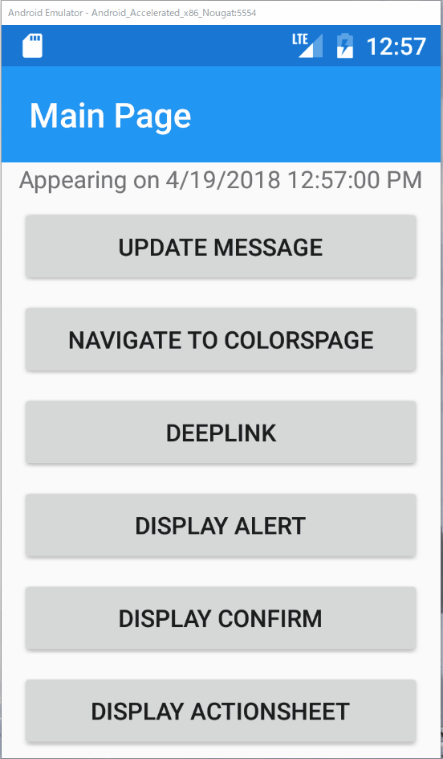

# 演習問題

それでは、ここまで学習してきた内容を生かして、アプリケーションにつぎのような修正を加えてみてください。

1. `ColorsPage`から任意の色を選んで`SelectedItemPage`へ遷移した後、アプリを強制終了し、再度アプリを起動したらDeepLinkで`SelectedItemPage`に遷移し、選択されていた色を表示しなさい
2. `SelectedItemPage`以外のページでアプリを強制終了し、再度アプリを起動したら、MainPageを表示しなさい

つぎのような動作を想定しています。



なおデータの永続化にはPrismが提供する[IApplicationStore](https://github.com/PrismLibrary/Prism/blob/master/Source/Xamarin/Prism.Forms/AppModel/IApplicationStore.cs)（実装クラスは[ApplicationStore](https://github.com/PrismLibrary/Prism/blob/master/Source/Xamarin/Prism.Forms/AppModel/ApplicationStore.cs)）を利用することで、Xamarin.Forms.ApplicationのPropertiesへ永続化することができます。

DIコンテナへ登録して利用しましょう。

DIコンテナへの登録する具体例
```cs
protected override void RegisterTypes(IContainerRegistry containerRegistry)
{
    ...
    containerRegistry.Register<IApplicationStore, ApplicationStore>();
}
```

インジェクションした場合の利用例

```cs
public class FooPageViewModel
{
    private readonly IApplicationStore _applicationStore;

    public FooPageViewModel(
        IApplicationStore applicationStore)
    {
        _applicationStore = applicationStore;
    }

    public void Bar()
    {
        _applicationStore.Properties["hoge"] = hoge;
        _applicationStore.SavePropertiesAsync();
    }
}
```

インジェクションできない場所（`App.xaml.cs`など）で利用する場合

```cs
var applicationStore = Container.Resolve<IApplicationStore>();
...
```

ヒント

* `INavigatingAware`と`INavigatedAware`を活用しましょう

.  
.  
.  
.  
.  
.  
.  
.  
.  
.  
.  
.  
.  
.  
.  
.  
.  
.  
.  
.  
.  
.  
.  
.  
.  
.  
.  
.  
.  
.  
[演習解答](99.演習解答.md)